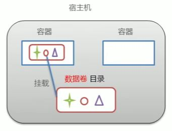
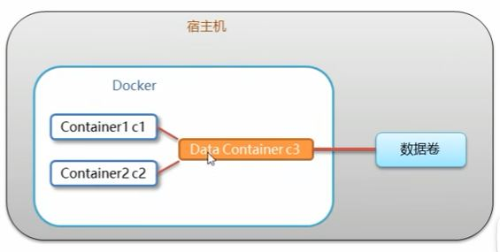
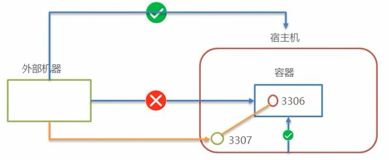

# Docker & Podman

## Docker

docker是一种容器技术，解决软件跨环境迁移的问题。

```shell
systemctl status docker
systemctl start docker
systemctl restart docker
systemctl enable docker // 开机启动docker
```

## Image

```shell
# review images
docker images 
// search images
docker search redis

# 拉取镜像, 如不写指定版本，默认拉去latest。
docker pull redis
podman pull docker.io/library/redis:7.0

# delete images
docker images // 查看 images id
docker rmi ec466c2297ad
podman rmi ec466c2297ad

# delete ALL images
docker rmi `docker images -q`
podman rmi $(podman images -qa) -f
```

## Container

### Review containers

```shell
podman ps -a 
podman inspect c2
```

### Create and run containers

- `-i`：保持容器运行。通常与 `-t` 同时使用。加入 `it` 这两个参数后，容器创建后会自动进入容器中，退出容器后`exit`，容器自动关闭。
- `-t`：为容器重启分配一个伪输入终端。`-t` 和 `-i` 通常同时使用，简化为 `-it`。
- `-d`：以守护（后台）模式运行容器。创建一个在后台运行，需要使用命令 `podman exec` 进入容器。退出容器后`exit`，容器不会关闭。
- `--name`：为容器命名。
- `-it` 为交互式容器, `-id` 为守护式容器。

````shell
# centos：根据什么镜像创建容器；/bin/bash：进入容器初始化指令；
podman run -it --name=c1 centos /bin/bash
podman run -id --name=c2 centos

# 如果选择-id，之后需要单独进入容器。
podman exec -it c2 /bin/bash

podman start c2
````

### Stop containers

```shell
podman stop c2
```

### Delete container

```shell
podman rm c1
podman rm c1 c2 c3 c4
```

## Data Volume

- 数据卷是宿主机中的一个目录或文件。
- 当容器目录和数据卷目录绑定后，数据会同步。
- 一个数据卷可以被多个容器同时挂在。
- 一个容器也可以挂载多个数据卷。



### Configure

创建启动容器时，使用 `-v` 参数设置数据卷。

`docker run ... -v 宿主机目录文件:容器内目录文件`*宿主机为是数据卷

目录必须为绝对路径。

````shell
podman run -it --name=c1 -v C:\Users\YinanLi\Desktop\data:/root/data_container centos /bin/bash
````

**一个容器挂在两个数据卷**

```shell
podman run -it --name=c2 
-v C:\Users\YinanLi\Desktop\data2:/root/data2 
-v C:\Users\YinanLi\Desktop\data3:/root/data3 centos
```

## Data Volume Container

多容器进行数据交换

- 多个容器挂在同一个数据卷
- 数据卷容器



创建c3数据卷容器，使用 `-v` 参数，设置数据卷。

```shell
docker run -it --name=c3 -v /volume centos /bin/bash
```

创建c1，c2容器，使用 `--volumes-from` 参数，设置数据卷。

```shell
docker run -it --name=c1 --volumes-from c3 centos /bin/bash
docker run -it --name=c2 --volumes-from c3 centos /bin/bash
```

## Port forwarding

- 容器内的网络服务和外部机器不能之间通信。
- 外部机器和宿主机可以直接通信。
- 宿主机和容器可以直接通信。
- 当容器中的网络服务需要被外部机器访问时，可以将容器中提供服务的端口映射到宿主机的端口上。外部机器访问宿主机的该端口，从而间接访问容器的服务。
- 这种操作称为：**端口映射**。



## Docker Images

Docker 镜像本质是一个分层文件系统。

镜像制作方式：

1. 容器转为镜像

   ```shell
   docker commit 容器id 镜像名称:版本号
   docker save -o 压缩文件名称 镜像名称:版本号
   docker load -i 压缩的文件名称
   ```

   * 数据卷挂载的数据不会写入镜像。

2. dockerfile

   **案例1 制作 centos 镜像**

   centos_dockerfile

   ````dockerfile
   # 定义父镜像 (本机没有会自动下载)
   FROM centos:7
   # 定义作者信息 <itheima@itcast.cn>
   MAINTAINER itheima 
   # 执行安装vim命令
   RUN yum install -y vim
   # 定义默认的工作目录
   WORKDIR /user
   # 定义容器启动执行的命令
   cmd /bin/bash
   ````

   Terminal:

   ```shell
   # 构建镜像
   docker build -f ./centos_dockerfile -t itheima_centos:1 .
   docker images
   docker run -it --name=c1 itheima_centos:1
   ```

   **案例2 制作 springboot 镜像**

   springboot_dockerfile

   ```dockerfile
   FROM java:8
   MAINTAINER itheima <itheima@itcast.cn>
   ADD springboot-hello-0.0.1-SNAPSHOT.jar app.jar
   CMD java -jar app.jar
   ```

   Terminal:

   ```shell
   docker build -f ./springboot_dookerfile -t app .
   docker images
   docker run -id -p 9000:8080 app
   # 宿主机9000和容器8080映射
   ```

   Browser

   ```
   192.168.149.135:9000/hello
   ```

## Docker Compose

Docker Compose 是一个编排多容器分布式部署的工具，提供命令集管理容器化应用的完整开发周期，包括服务构建，启动和停止。使用步骤：

1. 利用 Dockerfile 定义运行环境镜像。
2. 使用 docker-compose.yml 定义组成应用的各个服务。
3. 运行 docker-compose up 启动应用。

## Docker Registry

不希望镜像放到公网当中，就需要创建一个私有仓库。

**私有仓库创建**

```shell
# 1. 拉取私有仓库镜像
docker pull registry

# 2. 启动私有仓库容器 
docker run -id --name=registry -p 5000:5000 registry

# 3. 打开浏览器 输入地址http://localhost:5000/v2/_catalog，看到{"repositories":[]} 表示私有仓库 搭建成功

# 4. 修改daemon.json   
vim /etc/docker/daemon.json  

# 在上述文件中添加一个key，保存退出。此步用于让 docker 信任私有仓库地址；注意将私有仓库服务器ip修改为自己私有仓库服务器真实ip 
{"insecure-registries":["私有仓库服务器ip:5000"]} 

# 5. 重启docker 服务 
systemctl restart docker
docker start registry
```

**将镜像上传到私有仓库**

```shell
# 1. 标记镜像为私有仓库的镜像     
docker tag centos:7 私有仓库服务器IP:5000/centos:7
 
# 2. 上传标记的镜像     
docker push 私有仓库服务器IP:5000/centos:7
```

**从私有仓库拉取镜像**

```shell
# 拉取镜像 
docker pull 私有仓库服务器ip:5000/centos:7
```

